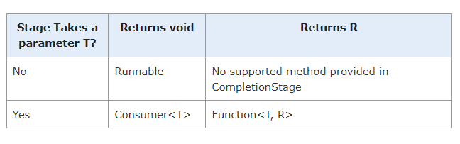

##  Asynchronous response types

On the transaction service

https://www.logicbig.com/tutorials/core-java-tutorial/java-multi-threading/completion-stage-and-completable-future.html


### `CompletionStages` interface

As all methods declared in this interface return an instance of `CompletionStage` itself, multiple `CompletionStages` can be chained together in different ways to complete a group of tasks.

### `CompletableFuture` class

Implements the `CompletionStages` interface. Applies to void and not void methods

### `CompletableFuture` for void methods

Two methods can ben used

```java
public static CompletableFuture<Void> runAsync(Runnable runnable)
public static CompletableFuture<Void> runAsync(Runnable runnable, Executor executor)
```

Example

```java
package com.logicbig.example;

import java.util.concurrent.CompletableFuture;

public class RunExample {
  public static void main(String[] args) {
      CompletableFuture<Void> cf =
              CompletableFuture.runAsync(() -> {
                  System.out.println("running, in thread: " + Thread.currentThread().getName());
              });
      cf.join();//waits until task is completed
      System.out.println("main exiting, thread: "+Thread.currentThread().getName());
  }
}
```

```shell
running, in thread: ForkJoinPool.commonPool-worker-3
main exiting, thread: main
```

### `CompletableFuture.join()` vs `Future.get()`

```java
public T join()
public T get() throws InterruptedException, ExecutionException
```

These methods implement two different interfaces, but they both wait and return the result value when completed.


### Chaining _CompletionStage_(s) with _runAsync()_
```java
CompletionStage<Void> thenRun(Runnable action)
CompletionStage<Void> thenRunAsync(Runnable action)
CompletionStage<Void> thenRunAsync(Runnable action, Executor executor)
```
Example

```java
package com.logicbig.example;

import java.time.LocalTime;
import java.util.concurrent.CompletableFuture;
import java.util.concurrent.CompletionStage;

public class RunExample2 {
  public static void main(String[] args) {
      CompletionStage<Void> cf =
              CompletableFuture.runAsync(() -> performTask("first stage"));
      cf = cf.thenRun(() -> performTask("second stage"));
      cf = cf.thenRunAsync(() -> performTask("third stage"));
      ((CompletableFuture) cf).join();//waits until task is completed
      System.out.println("main exiting");
  }

  private static void performTask(String stage) {
      System.out.println("---------");
      System.out.printf("stage: %s, time before task: %s, thread: %s%n",
              stage, LocalTime.now(), Thread.currentThread().getName());
      try {
          //simulating long task
          Thread.sleep(1000);
      } catch (InterruptedException e) {
          e.printStackTrace();
      }
      System.out.printf("stage: %s, time after task: %s, thread: %s%n",
              stage, LocalTime.now(), Thread.currentThread().getName());
  }
}
```

Output

```shell
---------
stage: first stage, time before task: 17:39:13.018213700, thread: ForkJoinPool.commonPool-worker-3
stage: first stage, time after task: 17:39:14.026771300, thread: ForkJoinPool.commonPool-worker-3
---------
stage: second stage, time before task: 17:39:14.026771300, thread: ForkJoinPool.commonPool-worker-3
stage: second stage, time after task: 17:39:15.027458600, thread: ForkJoinPool.commonPool-worker-3
---------
stage: third stage, time before task: 17:39:15.030441900, thread: ForkJoinPool.commonPool-worker-3
stage: third stage, time after task: 17:39:16.031504, thread: ForkJoinPool.commonPool-worker-3
main exiting
```

In above example the two async tasks ran in the same thread (created by the default executor) i.e. `ForkJoinPool.commonPool-worker-3`.

**Note**: 
* `CompletableFuture`, by default, uses an `Executor` created by `ForkJoinPool.commonPool()` (unless parallelism is not supported, in which case, a new Thread is created to run each task).
* For a non-async stage, the task is executed in the thread that completes the previous stage.

### Run with a non default _Executor_

As said the default exeutor is `ForkJoinPool.commonPool()`.
We can also run a `CompletableFuture` with a provided executor

```java
ublic class RunExample3 {
  public static void main(String[] args) {
      ExecutorService executor = Executors.newFixedThreadPool(3);

      CompletableFuture.runAsync(() -> performTask("first stage"), executor)
                       .thenRun(() -> performTask("second stage"))
                       .thenRunAsync(() -> performTask("third stage"), executor)
                       .join();//waits until task is completed
      System.out.println("main exiting");
      executor.shutdown();
  }

  private static void performTask(String stage) {
      System.out.println("---------");
      System.out.printf("stage: %s, time before task: %s, thread: %s%n",
              stage, LocalTime.now(), Thread.currentThread().getName());
      try {
          //simulating long task
          Thread.sleep(1000);
      } catch (InterruptedException e) {
          e.printStackTrace();
      }
      System.out.printf("stage: %s, time after task: %s, thread: %s%n",
              stage, LocalTime.now(), Thread.currentThread().getName());
  }
}
```

Output

```shell
---------
stage: first stage, time before task: 15:48:58.797553100, thread: pool-1-thread-1
stage: first stage, time after task: 15:48:59.809014600, thread: pool-1-thread-1
---------
stage: second stage, time before task: 15:48:59.810009, thread: pool-1-thread-1
stage: second stage, time after task: 15:49:00.811988700, thread: pool-1-thread-1
---------
stage: third stage, time before task: 15:49:00.813970800, thread: pool-1-thread-2
stage: third stage, time after task: 15:49:01.814515500, thread: pool-1-thread-2
main exiting
```

## Creating and Running tasks that return results

```java
public static <U> CompletableFuture<U> supplyAsync(Supplier<U> supplier)
public static <U> CompletableFuture<U> supplyAsync(Supplier<U> supplier, Executor executor)
```

Example

```java
public class SupplyExample {
  public static void main(String[] args) {
      CompletableFuture<Integer> cf =
              CompletableFuture.supplyAsync(() -> ThreadLocalRandom.current().nextInt(1, 10));
      Integer integer = cf.join();//similar to cf.get()
      System.out.println(integer);
  }
}
```

### Chaining CompletionStage(s) with supplyAsync()

Since `CompletableFuture.supplyAsync()` returns `CompletableFuture<T>`, only those methods defined in CompletionStage can be chained which require a function with argument of type T and optionally produce a result (of any type) :
```java
<U> CompletionStage<U> thenApply(Function<? super T, ? extends U> fn)
<U> CompletionStage<U> thenApplyAsync(Function<? super T,? extends U> fn)
<U> CompletionStage<U> thenApplyAsync(Function<? super T,? extends U> fn, Executor executor)
CompletionStage<Void> thenAccept(Consumer<? super T> action)
CompletionStage<Void> thenAcceptAsync(Consumer<? super T> action)
CompletionStage<Void> thenAcceptAsync(Consumer<? super T> action, Executor executor)
```
Example
```java
public class SupplyExample2 {
  public static void main(String[] args) {
      CompletableFuture.supplyAsync(() -> ThreadLocalRandom.current().nextInt(1, 10))
                       .thenApply(Math::sqrt)
                       .thenAccept(System.out::println)
                       .join();
  }
}
```

1.7320508075688772

There's very simple rule for chaining here:

The methods which return CompletionStage<Void> or CompletableFuture<Void> can only be chained with a method which takes a Runnable.
The methods which return CompletionStage<U> can be chained with methods which takes Consumer<U> or Function<U,R>.

Example

Following is another example which reads the content of a web page:

package com.logicbig.example;

```java
package com.logicbig.example;

import java.io.InputStream;
import java.net.URL;
import java.util.concurrent.CompletableFuture;
import java.util.concurrent.ThreadLocalRandom;

public class SupplyExample4 {
    public static void main(String[] args) {
        CompletableFuture.supplyAsync(() -> {
                    try {
                        URL url = new URL("https://www.example.com/");
                        try (InputStream is = url.openStream()) {
                            return new String(is.readAllBytes());
                        }
                    } catch (Exception e) {
                        throw new RuntimeException(e);
                    }
                }).thenAccept(System.out::println)
                .thenRun(() -> System.out.println("Task finished"))
                .join();
    }
}

```

The first task created by a static factory methods of CompletableFuture is modeled by a Runnable or Supplier.

In the case of Runnable, subsequent completion stages are also of Runnable.

In the case of Supplier, subsequent completion stages can be of either Consumer or Function depending whether the target stage should return a value or not. Also a stage involving a Consumer<T> can only be further chained with a stage involving Runnable.

The intermediate completion stages can be summarized as:


