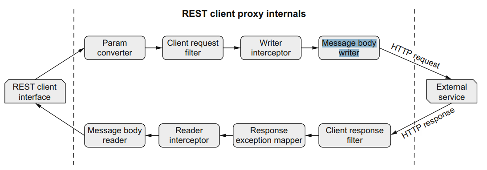

# Clients for consuming other microservices

The Transaction service calls the Account service to retrieve the current balance to ensure the requested transaction doesn’t result in an overdrawn account.


## MicroProfile REST

Implementing a REST API has many challenges.

Using a type-safe approach with **MicroProfile REST Client** enables us to discover these types of problems during compilation and not much later during execution.
The client combines good practices to solve the following problems

* Including additional client headers onto any external request
* Following responses redirecting to another URL
* Calling external services through an HTTP proxy
* Registering custom providers for filtering, message body manipulation, interceptors, and exception mappers
* Automatic registration of JSON-P and JSON-B providers
* Configuring SSL for REST client endpoints

## Service interface definition

The API can be defined as a Java interface and shared among the server and the client to guarantee a type safe communication.
The interface can be enriched with ```jakarta.ws``` annotations to state in the API contracts the endpoint path, the parameters, the supported methods and serialization technology.
Reusing the same well-known JAX-RS annotations that will be used in the implementation, it will guardantee that no contract breaking implementation will happen (even though the design and the implementation details are here coupled).

```java
@Path("/api/accounts")
//Indicates that the interface should have a CDI bean created that can be injected into classes
@RegisterRestClient
@Produces(MediaType.APPLICATION_JSON)
public interface AccountService {
    @GET
    @Path("/{acctNumber}/balance")
    BigDecimal getBalance(@PathParam("acctNumber") Long accountNumber);

    @POST
    @Path("{accountNumber}/transaction")
    void transact(@PathParam("accountNumber") Long accountNumber,
                  BigDecimal amount);
}
```

For reference: ```banikng-api``` 

### NOTE
1. The module for API contains only API interfaces
2. An empty ````META-INF/beans.xml```` is necessary to inform Quarkys beans discovery to search for CDI beans within the api module when a consumer imports it (e.g. the rest api client)
```xml
<?xml version="1.0" encoding="UTF-8"?>
<beans xmlns="https://jakarta.ee/xml/ns/jakartaee"
       xmlns:xsi="http://www.w3.org/2001/XMLSchema-instance"
       xsi:schemaLocation="https://jakarta.ee/xml/ns/jakartaee https://jakarta.ee/xml/ns/jakartaee/beans_4_0.xsd">

</beans>
```

### _@RegisterRestClient_ annotation

About the ```` @RegisterRestClient````, it tells Quarkus that a CDI bean that contains the methods on the interface needs to be created.
Quarkus automatically creates such a CDI bean, so that calls to the interface methods result in HTTP calls to the external service.


1. The JAX-RS calls a method on the ``AccountService`` interface, which executes the call on the CDI bean that implements the interface
2. The CDI bean, representing the AccountService interface, configures the HTTP client with the URL, HTTP method type, content types, headers, or anything else needing to be set on the HTTP request.
3. The HTTP client issues the HTTP request to the external Account service and handles the response that’s returned.

The **base uri** of the api call being used in the call from the Rest client (transaction-service) can be configured in the ``application.properties``:

```properties
# format quarkus.rest-client.<FQN>.[url|scope]
quarkus.rest-client."accountservice.api.AccountService".url=https://stage.code.quarkus.io 
quarkus.rest-client."accountservice.api.AccountService".scope=jakarta.inject.Singleton #
```

#### MicroProfile Rest Client configuration

An alternative configuration from the **MicroProfile Rest Client can be used ** for the Quarkus generated CDI bean implementing the _@RegisterRestClient_ service interface.

```properties
accountservice.api.AccountService/mp-rest/url=https://stage.code.quarkus.io/api
accountservice.api.AccountService/mp-rest/scope=jakarta.inject.Singleton
```

To facilitate this confiuguration the **config key** can be used in the 

With this setting in place one generated call will be ``https://stage.code.quarkus.io/api/accounts/{acctNumber}/balance``

An alternative will be to use the **confg key** with the _@RegisterRestClient_

````java
@RegisterRestClient(configKey = "account-service")
````

This will make the configuration easier (without the need of using the FQN of the service class)

```properties
# format quarkus.rest-client.<config key>.[url|scope]
quarkus.rest-client.account-service.url=https://stage.code.quarkus.io/api
quarkus.rest-client.account-service.scope=jakarta.inject.Singleton
```

## API server

The implementing class is ``accountservice/resources/AccountServiceApiImpl.java`` extending the API interface.

## CDI REST client

Create the ``TransactionResource`` class

### Mocking the external call

Add dependency

```xml
<dependency>
 <groupId>com.github.tomakehurst</groupId>
 <artifactId>wiremock-jre8</artifactId>
 <scope>test</scope>
</dependency>
```

Quarkus provides ``QuarkusTestResourceLifecycleManager``. Implementing ``QuarkusTestResourceLifecycleManager`` enables us to customize what happens during ``start()`` and ``stop()`` during
the life cycle of a test. Any implementation is applied to a test with @QuarkusTestResource. 
One is needed to interact with the WireMock server as in the ``src/test/java/transactionservice/config/WiremockAccountService.java``

Then we can test as in ``src/test/java/transactionservice/resource/TransactionResourceTest.java``


## Deployment to Kubernetes

The _Route_ exposed by the _account-service_ application on Kubernetes must be used for the prod profile configuration in the _transaction-service_

```properties
%prod.quarkus.rest-client.account-service.url=http://account-service-xan80-dev.apps.sandbox-m4.g2pi.p1.openshiftapps.com
%prod.quarkus.rest-client.account-service.scope=singleton
```

## Customizing REST clients

### Client request headers

We can add the headers to the client call method 

```java
@Path("/api/accounts")
@ClientHeaderParam(name = "class-level-param", value = "AccountServiceinterface") //Adds class-level-param to the outgoing HTTP request header.
    // At class level it will be added to all methods
@RegisterClientHeaders //Indicates the default ClientHeadersFactory should be used. The default factory will propagate any
    //headers from an inbound JAX-RS request onto the outbound client request, where the headers are
    //        added as a comma-separated list into the configuration key named
    //        org.eclipse.microprofile.rest.client.propagateHeaders. A custom ClientHeadersFactory can also be added
        ...
public interface AccountService {
    ...

    @POST
    @Path("{accountNumber}/transaction-headers")
    @ClientHeaderParam(name = "method-level-param", value = "{generateParameterValue}")
        //Similar to the usage of @ClientHeaderParam on the type, it adds the method-level-param header to
        //the outbound HTTP request to the external service.
    Map<String, List<String>> transactionHeaders(@PathParam("accountNumber") Long
                                                accountNumber, BigDecimal amount, @Context HttpHeaders httpHeaders);

    /**
     * Default method on the interface used to create a value for the header on transactionHeaders
     * TODO: dafault method is not supported in quarkus native image build
     * @return
     */
    default String generateParameterValue() {
        return "Value generated in method for async call";
    }
}
```

In the server we can inject the incoming request headers

```java
@POST
    @Path("{accountNumber}/transaction-headers")
    public Map<String, List<String>> transactionHeaders(@PathParam("accountNumber") Long
                                                                accountNumber, BigDecimal amount,
                                                        @Context HttpHeaders httpHeaders) { //@Context is equivalent to @Inject for CDI in the JAX-RS
        //returns the headers from the incoming call including the class and method level ones defined in the AcccountService interface
        return httpHeaders.getRequestHeaders();
    }
```

### Changing providers

This is the sequence of processing REST client interfaces in JAX-RS, for each we can define a _provider_ to customize its behavior



**NOTE**: thi applies to the communications between the ``AccountService`` server and client! Not to the calls to the ``TransactionResource`` which is the exposed resource.

We can define a provider by:

* Annotating the class with ``@Provider``
* Associate the provider with the REST client interfaces with ``@RegisterProvider(MyProvider.class)``
* When using the programmatic approach, use ``builder.register(MyProvider.class)``
* Implement either ``RestClientBuilderListener`` or ``RestClientListener``, and
  register the provider directly onto the ``RestClientBuilder`` 

#### Create a _ClientRequestFilter_ provider

The implementation of the REST client interfaces is

```java
public class AccountRequestFilter implements ClientRequestFilter {

    private static final Logger LOGGER = LoggerFactory.getLogger(AccountRequestFilter.class);

    /*
    This implementation adds the invoked method to the request as a param
     */
    @Override
    public void filter(ClientRequestContext requestContext) throws IOException {
        LOGGER.info("Inside the AccountRequestFilter provider method");
        Method invokedMethod =
                (Method) requestContext.getProperty("org.eclipse.microprofile.rest.client.invokedMethod");
        requestContext.getHeaders().add("Invoked-Client-Method", invokedMethod.getName());
    }
}
```

In this case we are manipulating the call to the ``AccountService`` server by adding a header to the client call.

Then we add the filter as a provider to the ``AccountService`` contract:

```java
@RegisterProvider(AccountRequestFilter.class) //Adds the ClientRequestFilter Rest service interface impl as provider
public interface AccountService {
  ...
}
```

We could also annotate the class with ``@Provider``, but with this approach we make it part of the shared contract.


